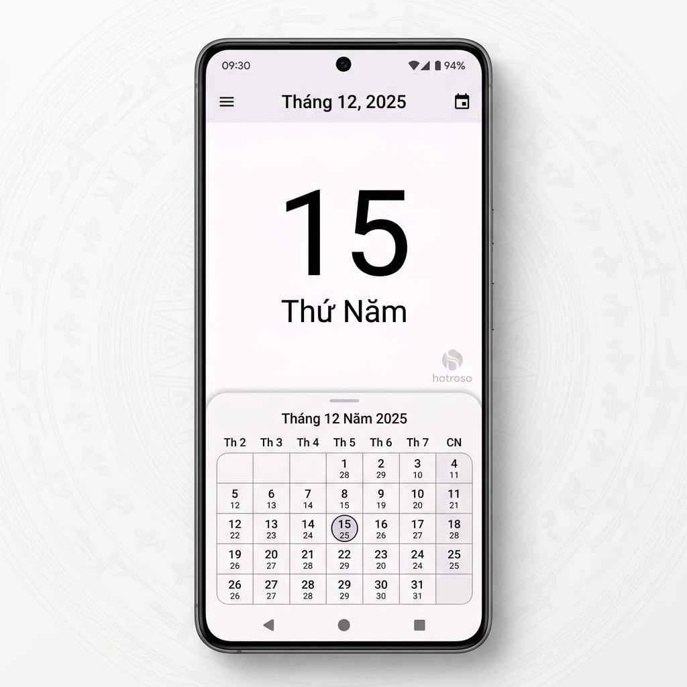

<p align="center">
  
</p>

<h1 align="center">Âm Lịch Việt Nam</h1>

<p align="center">
  Ứng dụng xem lịch Âm - Dương chính xác, đơn giản dành cho người Việt.
</p>

<p align="center">
  <a href="https://github.com/hotroso/am-lich-viet-nam/releases/latest">
    
  </a>
  <a href="LICENSE">
    
  </a>
  <a href="https://github.com/hotroso/am-lich-viet-nam/actions">
    
  </a>
</p>

---

## Tính năng

- 📅 **Xem ngày Âm/Dương** — Hiển thị chính xác ngày lịch âm và dương
- 🐉 **Can Chi** — Tra cứu Can Chi năm, tháng, ngày, giờ
- ⏰ **Giờ Hoàng Đạo** — Thông tin khung giờ tốt trong ngày
- 🌿 **Tiết Khí** — Theo dõi 24 tiết khí trong năm
- 📖 **Nhị Thập Bát Tú** — Chi tiết 28 ngôi sao theo ngày
- 🧭 **Hướng xuất hành** — Tài thần, Hỷ thần, Hạc thần
- 🔄 **Chuyển đổi ngày** — Dương lịch ⇄ Âm lịch
- 📌 **Sự kiện âm lịch** — Lên lịch ngày giỗ, sinh nhật âm lịch với nhắc nhở tự động
- 📱 **Widget** — 3 loại widget hiển thị trên màn hình chính
- 📤 **Chia sẻ** — Chia sẻ thông tin ngày qua tin nhắn, mạng xã hội

## Tải về

| Kênh | Link |
|------|------|
| GitHub Release | [Download APK](https://github.com/hotroso/am-lich-viet-nam/releases/latest) |

Quét QR code trên trang Release để tải trực tiếp về điện thoại.

## Yêu cầu

- Android 5.0 (Lollipop) trở lên
- Không cần internet

## Công nghệ

| | |
|---|---|
| Ngôn ngữ | Kotlin |
| Kiến trúc | MVVM |
| Database | Room |
| Background | WorkManager + AlarmManager |
| UI | CoordinatorLayout, BottomSheet, RecyclerView |
| Build | Gradle + KSP |

## Cấu trúc dự án

```
app/src/main/java/io/github/hotroso/vietnameselunarcalendar/
├── lunar/          # Logic tính toán lịch âm dương, Can Chi, Tiết Khí
├── ui/             # Custom views (CalendarView2, CellView, DigitalClock)
├── widget/         # App widgets (3 loại) + config activity
├── reminder/       # Quản lý sự kiện âm lịch (Room DB + notifications)
├── MainActivity.kt
├── MainFragment.kt
└── ...
```

## Build

```bash
# Debug
./gradlew assembleDebug

# Release (cần keystore)
./gradlew assembleRelease
```

## Release

```bash
git tag v2.3
git push origin v2.3
```

GitHub Actions sẽ tự động build APK signed, tạo release, và gắn QR code.

## Đóng góp

Mọi đóng góp đều được hoan nghênh. Vui lòng mở Issue trước khi tạo PR cho các thay đổi lớn.

## License

Source Available — **Non-Commercial Use Only**

Bạn được tự do sử dụng, sửa đổi, và phân phối cho mục đích phi thương mại. Xem [LICENSE](LICENSE) để biết chi tiết.

Liên hệ cấp phép thương mại: [github.com/hotroso](https://github.com/hotroso)

---

<p align="center">
  Made with ❤️ by <a href="https://github.com/hotroso">Hỗ trợ giải pháp số</a>
</p>
