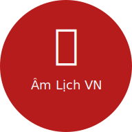

<p align="center">
  
</p>

<h1 align="center">🌙 Âm Lịch Việt Nam — Web App (PWA)</h1>

<p align="center">
  <b>Xem ngày Âm - Dương chính xác, tra Can Chi, Giờ Hoàng Đạo và quản lý sự kiện âm lịch — ngay trên trình duyệt, không cần cài đặt.</b>
</p>

<p align="center">
  <a href="https://amlich.hotrogiaiphapso.info/"></a>
  <a href="https://github.com/hotroso/am-lich-viet-nam/blob/webapp/LICENSE"></a>
</p>

<p align="center">
  <a href="https://amlich.hotrogiaiphapso.info/"><b>🌐 Truy cập ngay</b></a> · 
  <a href="https://github.com/hotroso/am-lich-viet-nam/tree/main"><b>📱 Phiên bản Android</b></a>
</p>

---

## Giới thiệu

Đây là phiên bản **Progressive Web App (PWA)** của ứng dụng Âm Lịch Việt Nam. Giao diện được thiết kế giống với phiên bản Android native, hoạt động trên mọi trình duyệt, hỗ trợ cài đặt về màn hình chính và sử dụng offline.

## ✨ Tính năng

| | |
|---|---|
| 📅 **Lịch Âm - Dương** | Hiển thị song song, tự nhận diện tháng nhuận |
| 🐉 **Can Chi đầy đủ** | Năm, tháng, ngày, giờ |
| ⏰ **Giờ Hoàng Đạo** | Khung giờ tốt trong ngày |
| 🌟 **Đánh giá ngày** | Dựa trên Trực + Hoàng Đạo, gợi ý "Nên làm" / "Không nên" |
| 🌿 **24 Tiết Khí** | Theo dõi trọn năm |
| 🧭 **Hướng xuất hành** | Tài thần, Hỷ thần, Hạc thần |
| 📌 **Sự kiện & nhắc nhở** | Lưu ngày giỗ, sinh nhật âm lịch — nhắc đúng ngày mỗi năm |
| 🔄 **Chuyển đổi ngày** | Dương → Âm, Âm → Dương |
| 📈 **Sắp tới** | Xem sự kiện trong 90 ngày tới |
| 📲 **PWA** | Cài về màn hình chính, dùng offline |
| 🍎 **Tương thích Safari** | Hỗ trợ iOS/Safari với safe-area, dvh, install banner |

## 🌐 Demo

👉 **[https://amlich.hotrogiaiphapso.info/](https://amlich.hotrogiaiphapso.info/)**

Trên điện thoại: mở link → nhấn "Thêm vào Màn hình chính" để dùng như app native.

## 📁 Cấu trúc dự án

```
am_lich_web/
├── index.html          # Trang chính (SPA)
├── manifest.json       # PWA manifest
├── sw.js               # Service Worker (offline & cache)
├── css/
│   └── style.css       # Giao diện (Android-style layout)
├── js/
│   ├── app.js          # Controller chính
│   ├── lunar-calendar.js  # Thuật toán lịch âm (Hồ Ngọc Đức)
│   ├── canchi.js       # Can Chi, Tiết Khí, Trực, Ngũ Hành
│   ├── events-db.js    # IndexedDB quản lý sự kiện
│   └── notification.js # Push notification & nhắc nhở
├── icons/              # App icons (SVG + PNG)
└── deploy/             # Scripts cài đặt server (Apache2 + SSL)
```

## 🛠️ Công nghệ

| | |
|---|---|
| Frontend | HTML5, CSS3, Vanilla JavaScript (không framework) |
| Storage | IndexedDB |
| Offline | Service Worker + Cache API |
| Server | Apache2, Let's Encrypt SSL |
| Tương thích | Chrome, Firefox, Safari (iOS 15+), Edge |

## 🚀 Deploy

### Yêu cầu
- Ubuntu server + Apache2
- Domain đã trỏ DNS

### Cài đặt lần đầu

```bash
git clone -b webapp https://github.com/hotroso/am-lich-viet-nam.git
cd am-lich-viet-nam/deploy
sudo chmod +x setup.sh
sudo ./setup.sh
```

### Cập nhật

```bash
cd /path/to/am-lich-viet-nam
git pull origin webapp
cd deploy
sudo ./update.sh
```

### Dev local

```bash
npx serve . -l 3000
# Mở http://localhost:3000
```

## 📱 So sánh phiên bản

| | Android (main) | Web PWA (webapp) |
|---|---|---|
| Nền tảng | Android 5.0+ | Mọi trình duyệt |
| Ngôn ngữ | Kotlin | JavaScript |
| Offline | ✅ Native | ✅ Service Worker |
| Widget | ✅ 3 loại | ❌ |
| Notification | ✅ Native | ✅ Web Push (iOS 16.4+) |
| Cài đặt | APK / Play Store | Add to Home Screen |

## ⭐ Star

Nếu bạn thấy hữu ích, hãy để lại ⭐ cho repo!

## 🤝 Đóng góp

Mọi đóng góp đều được hoan nghênh. Với các thay đổi lớn, vui lòng mở Issue trước khi tạo Pull Request.

## 📄 Giấy phép

**Source Available — Chỉ dùng cho mục đích phi thương mại.**

Bạn được tự do sử dụng, sửa đổi và phân phối cho mục đích phi thương mại. Xem chi tiết tại [LICENSE](LICENSE).

Liên hệ cấp phép thương mại: [github.com/hotroso](https://github.com/hotroso)

---

<p align="center">Made with ❤️ by <a href="https://github.com/hotroso">Hỗ trợ giải pháp số</a></p>
